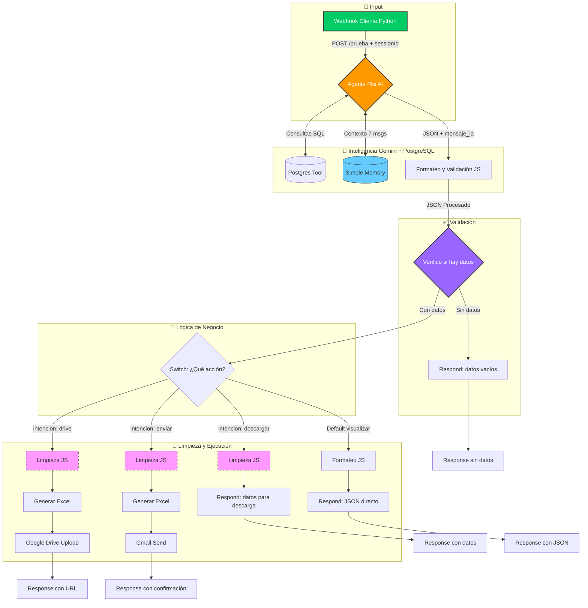
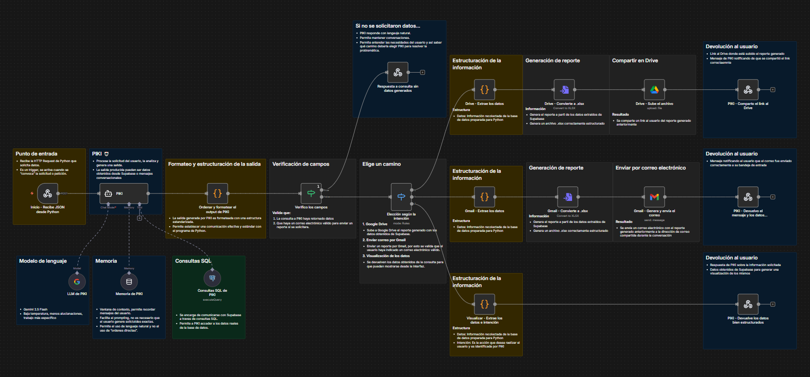

# Sistema Tracking - Grupo 6

**Versión:** 18.0.0 (Final Version)  
**Fecha:** 05-12-2025

## 1. Estado Actual del Flujo (Snapshot)

El flujo ha evolucionado hacia una arquitectura más limpia y robusta. El "Cerebro" ahora tiene personalidad definida ("Piki") y capacidad de generar respuestas en lenguaje natural, además de orquestar las consultas a base de datos. Finalmente, todas las funciones principales han sido solventadas.

- **Punto de Entrada:**
  - **Producción:** Webhook (`POST /prueba`). Diseñado para ser consumido por el cliente en **Python**.
  - **Sesión:** Utiliza `sessionId` del cuerpo de la solicitud para mantener contexto conversacional
- **Cerebro (AI Agent):** Agente actualizado a **"Piki"** con Gemini AI.
  - _Mejora v18.0.0:_ Ahora devuelve un campo `mensaje_ia` con un mensaje amigable en lenguaje natural, además de la data estructurada.
  - _Sistema de memoria:_ Mantiene contexto de conversación con hasta 7 mensajes previos
  - _Integración con Postgres:_ Utiliza herramienta SQL para consultas directas a la base de datos
- **Validación de Datos:**
  - Se implementó nodo de verificación (`Verifico si hay datos`) antes del Switch
  - **Resultado:** Respuestas consistentes incluso cuando no hay datos disponibles
- **Procesamiento de Datos:**
  - Se implementaron nodos de limpieza (Javascript) previos a la generación de archivos
  - **Resultado:** Los archivos Excel generados contienen **únicamente** la data útil (sin columnas técnicas como `sql_query` o `accion`)
- **Ramas de Acción:**
  - `drive`: Sube el reporte limpio a Google Drive y devuelve URL
  - `enviar`: Envía el reporte limpio por Gmail con plantilla HTML personalizada
  - `descargar`: Devuelve datos para descarga local (procesado por cliente Python)
  - `visualizar`: Devuelve el JSON puro con la respuesta de Piki al cliente Python

### Arquitectura del Flujo (Diagrama)

---

## 2. Registro de Cambios (Changelog)

### ✅ Hitos Completados (v18.0.0)

#### Sistema de Memoria Conversacional
- **Implementado:** Simple Memory con contexto de 7 mensajes
- **Beneficio:** Piki ahora recuerda el contexto de la conversación, permitiendo preguntas de seguimiento
- **Uso:** El campo `sessionId` del webhook mantiene la sesión entre múltiples consultas

#### Validación de Datos Mejorada
- **Nuevo nodo:** "Verifico si hay datos" antes del Switch
- **Comportamiento:** Si no hay datos disponibles, retorna respuesta vacía consistente en lugar de fallar
- **Mejora:** Mejor experiencia de usuario con mensajes claros cuando no hay resultados

#### Integración Directa con PostgreSQL
- **Herramienta:** Execute a SQL query in Postgres
- **Función:** Piki genera y ejecuta queries SQL directamente contra la base de datos
- **Ventaja:** Datos en tiempo real sin necesidad de cache o datasets estáticos

#### Limpieza de Excel Definitiva
- Se solucionó el error donde los archivos exportados incluían columnas internas (`accion`, `query`)
- Ahora se usa un pre-procesamiento JS para filtrar solo el diccionario `data`
- **Resultado:** Archivos Excel limpios y profesionales

#### Mejoras en Respuestas
- Campo `mensaje_ia` para contexto verbal consistente en todas las respuestas
- Plantilla HTML mejorada para emails de Gmail con imagen de Piki
- URLs de Drive devueltas correctamente en campo `url`
- Manejo de `email_destinatario` desde el JSON de Piki

#### Rama "Descargar" Funcional  
- Cambio de estado: ~~WIP~~ → **Funcional**
- Los datos se retornan al cliente Python para procesamiento local
- El cliente maneja la generación del archivo (no n8n)

---

## 3. Flujo Actual

**Proyecto finalizado**  
**Hecho con ❤️ durante la Capacitación en Artech**

