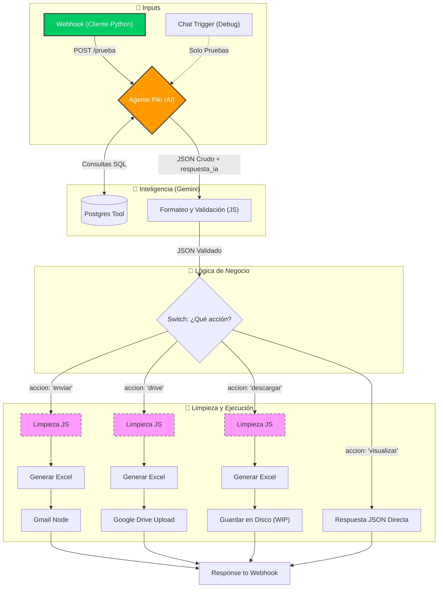

# Sistema Tracking - Grupo 6

**Versión:** 2.0.0 (Update Piki & Data Cleaning)
**Fecha:** 25-11-2025

## 1. Estado Actual del Flujo (Snapshot)

El flujo ha evolucionado hacia una arquitectura más limpia y robusta. El "Cerebro" ahora tiene personalidad definida ("Piki") y capacidad de generar respuestas en lenguaje natural, además de orquestar las consultas a base de datos.

- **Punto de Entrada:**
  - **Producción:** Webhook (`POST /prueba`). Diseñado para ser consumido por el cliente en **Python**.
  - **Debugging:** Chat Trigger. Se mantiene únicamente para pruebas internas dentro de n8n. En versiones anteriores se eliminará.
- **Cerebro (AI Agent):** Agente actualizado a **"Piki"**.
  - _Mejora v2.0:_ Ahora devuelve un campo `respuesta_ia` con un mensaje amigable en lenguaje natural, además de la data estructurada. Esto puede ser utilizado en Python para mostrar este mensaje por pantalla.
- **Procesamiento de Datos:**
  - Se implementaron nodos de limpieza (Javascript) previos a la generación de archivos.
  - **Resultado:** Los archivos Excel generados contienen **únicamente** la data útil (sin columnas técnicas como `sql_query` o `accion`).
- **Ramas de Acción:**
  - `drive`: Sube el reporte limpio a Google Drive.
  - `enviar`: Envía el reporte limpio por Gmail.
  - `descargar`: (WIP) Guardado en disco local.
  - `visualizar`: Devuelve el JSON puro con la respuesta de Piki al cliente Python.

### Arquitectura del Flujo (Diagrama)

# 2. Registro de Cambios (Changelog)

## ✅ Hitos Completados (FIXES v2.0)

Limpieza de Excel Definitiva: Se solucionó el error donde los archivos exportados incluían columnas internas (accion, query). Ahora se usa un pre-procesamiento JS para filtrar solo el diccionario data.

Integración de "Piki": Se actualizó el System Prompt. Ahora el JSON de respuesta incluye el campo mensaje_ia para dar contexto verbal al usuario, separándolo de los datos crudos.

Gmail: Confirmado el funcionamiento correcto del envío de adjuntos.

## 🚧 Tareas Pendientes (WIP)

1. Lectura/Escritura Local: La rama de "descargar" y la interacción directa con el disco local (Read/Write Files) aún no están 100% implementadas/validadas.

2. Refactorización JS: Actualmente hay múltiples nodos de "Code in JavaScript" que hacen lo mismo (limpiar data) en diferentes ramas. Se buscará una forma de unificar esta lógica para no repetir código (DRY).

# Flujo actual

