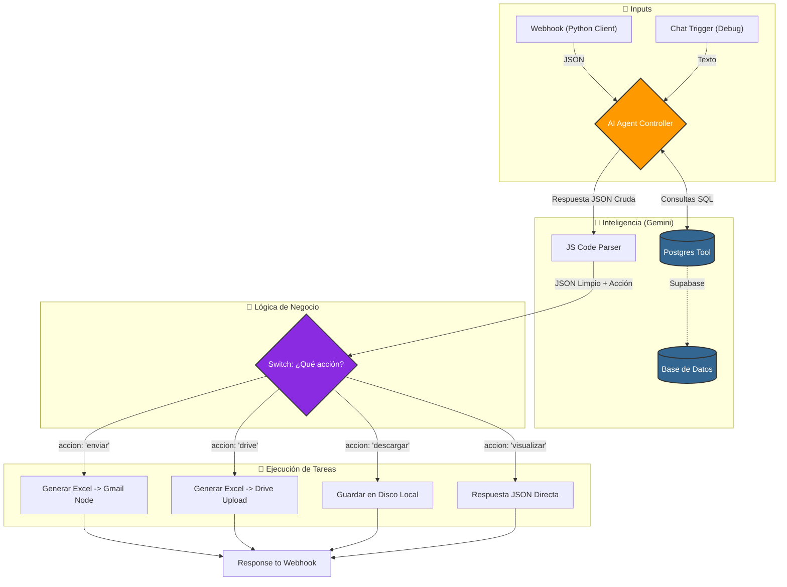

# Sistema Tracking - Grupo 6

Fecha de versión: 19-11-2025

1. Estado Actual del Flujo (Snapshot)
   El flujo opera bajo una lógica de "Agente Orquestador". El usuario consulta, Gemini decide si necesita datos de la DB (vía Tool Postgres), estructura la respuesta y el flujo decide qué hacer con ella (responder, enviar mail, guardar archivo).

Punto de Entrada: Actualmente activo mediante Chat Trigger (Pruebas internas). Nota: El Webhook HTTP estándar parece desconectado del Agente en esta versión.

Cerebro (AI Agent): Configurado como "Lía".

System Prompt: Altamente estructurado. Fuerza salida JSON estricta (accion, datos, query_sql).

Herramientas: Conexión directa a Postgres para consultas de lectura (SELECT).

Procesamiento (Code Node): Script JS robusto que limpia y parsea el JSON de Gemini para alimentar el Switch.

Ramas de Acción (Switch):

drive → Sube a Google Drive.

descargar → Guarda en disco local.

enviar → Envía reporte por Gmail.

visualizar (Default) → Responde JSON al cliente.

### Arquitectura del Flujo (Diagrama)

## Registro de Cambios y Notas Técnicas

### ✅ Hitos Completados (FIXES)

"Se arregló la funcionalidad de GMAIL, ahora manda los mails correctamente. El nodo Send a message está correctamente enlazado tras la conversión a archivo binario (XLSX)."

### 🧠 Estado del Agente (AI)

"El prompt parece funcionar consistentemente, generando la estructura JSON requerida, pero estaría bueno revisarlo y consultar para optimizar casos borde o inyecciones de prompt."

### 🚧 Tareas Pendientes (WIP - Work In Progress)

1. Falta trabajar en el nodo Drive y Read/Write files from disk.
2. También hay que formatear correctamente el archivo .xlsx que se genera, ya que las columnas deberían tener nombres claros, además, hay que evitar subir el archivo con el campo "acción" y "sql_query"

## Flujo actual

